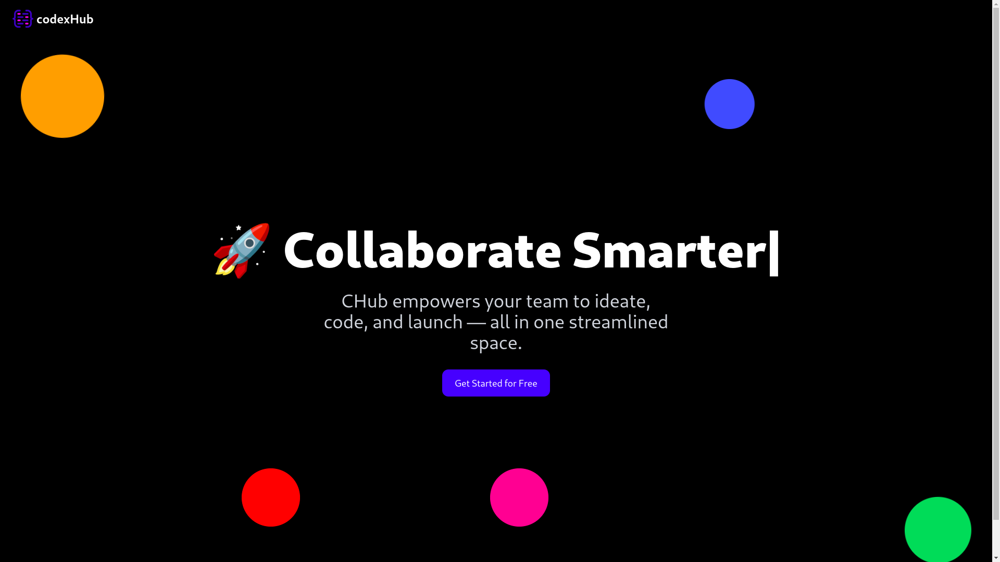
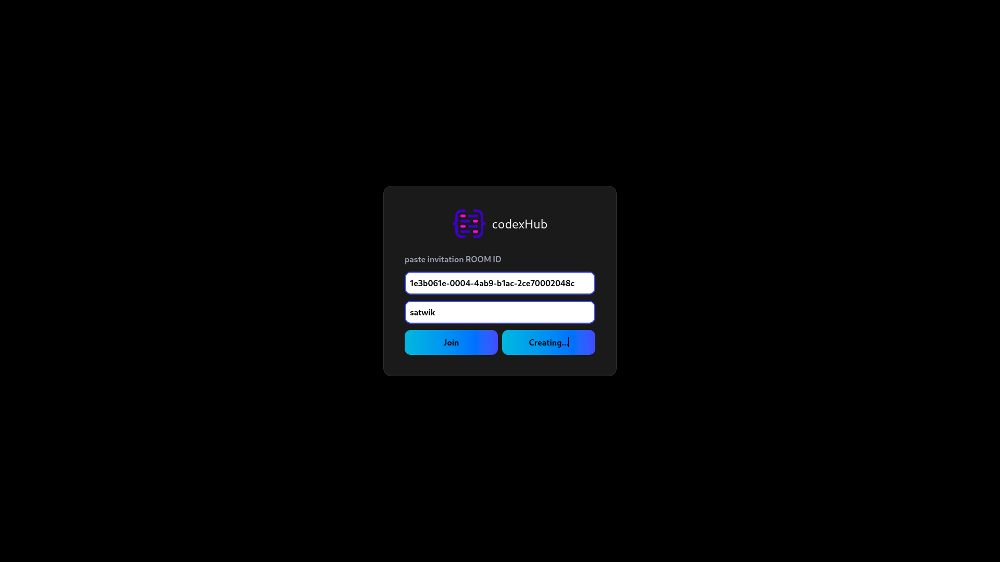
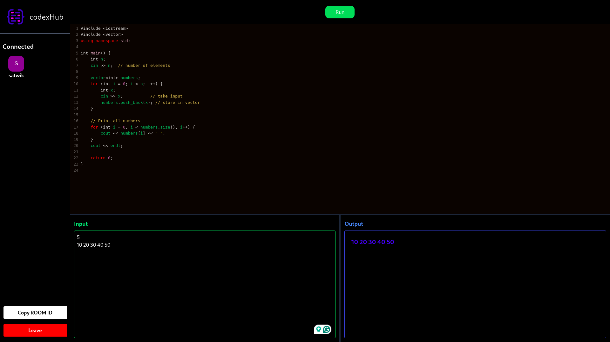
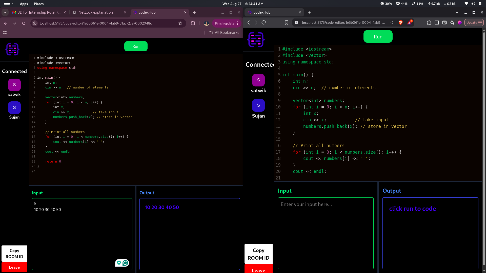

# ⚡ CodexHub


**CodexHub** is a **real-time collaborative C++ code editor** where users can create rooms, join with others, and work on code together with **live cursors, instant syncing, and remote execution**.  

---

## 🚀 Features

- 🔑 **Room-Based Collaboration** — Instantly create or join rooms with unique IDs.  
- 👥 **Multi-User Sync** — Collaborate in real time with multiple users.  
- 📝 **Interactive Code Editor** — Write, edit, and format C++ code using **CodeMirror**.  
- ▶️ **Instant Code Execution** — Run code with input/output via **JDoodle API** (20 credits/day).  
- ⚡ **Low-Latency Collaboration** — Real-time edits powered by **Socket.io**.  
- 🌐 **Cross-Browser Support** — Works smoothly on all modern browsers.  

---

## 🛠️ Tech Stack

| Layer       | Technology           |
|------------|---------------------|
| Frontend   | React, CodeMirror   |
| Backend    | Node.js, Express, Socket.io |
| Database   | MongoDB             |
| Compiler API | JDoodle API        |
| Architecture | MERN Stack         |

---

## 📸 Screenshots

### 🏠 Landing Page
Click **Get Started** to begin your journey.  


### 🔑 Room ID Generation
Create a new room or join an existing one.  


### 💻 Code Editor
Write C++ code, provide inputs, and run instantly.  


### 🌐 Multi-User Collaboration
Collaborate in real-time with multiple users.  


---

## 💻 Getting Started

### Prerequisites
- Node.js installed  
- MongoDB running locally or on cloud (Atlas)  
- JDoodle API credentials  

### Installation

```bash
# Clone the repository
git clone https://github.com/your-username/codexhub.git

# Navigate into the project
cd codexhub

# Install client dependencies
cd client
npm install

# Install server dependencies
cd ../server
npm install

# Start development server
./start-dev.sh

